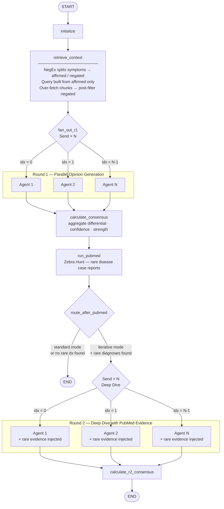

# MedGemma Clinical Assistant

**AI-powered clinical decision support built on MedGemma and MedASR.**

> Built for the [Google MedGemma Impact Challenge](https://www.kaggle.com/competitions/med-gemma-impact-challenge)

---

## Quick Start

```bash
# Simulated mode (no GPU required)
SIMULATED_MODE=true uv run python main.py

# Full mode (requires MedGemma + MedASR access)
uv run python main.py
```

Open: http://localhost:8000

---

## Features

### Encounter — Multimodal SOAP Generation

The physician speaks; MedGemma listens. MedASR transcribes dictation in real time while MedGemma simultaneously analyses attached medical images (X-ray, CT, MRI). The system merges speech, imaging findings, and live FHIR EHR context into a structured SOAP note with ICD-10 codes, critical alerts, and missed-diagnosis flags — all pending physician approval before committing to the chart.

A background PubMed synthesis agent runs three searches in parallel: rare-diagnosis hunting, evidence-based medicine validation, and drug–drug interaction monitoring. Results surface in a collapsible literature panel beside the note.


---

### Diagnostic Council — Multi-Agent Deliberation

Five independent MedGemma instances reason over the same case in parallel via a LangGraph fan-out graph. Each agent produces a ranked differential with confidence scores. The orchestrator aggregates all five into a consensus differential, surfacing where the agents agree and where they diverge.

When the consensus is weak or a rare diagnosis appears in the PubMed hunt, the council enters a **Deep Dive** second round: the PubMed findings are injected as context and the agents deliberate again, updating or defending their original positions.




---

### AI Chat Portal — Physician Queries with Image Annotation

Physicians can ask free-form questions, attach medical images, and draw bounding boxes to direct MedGemma's attention to a specific region of interest. Voice input is supported alongside text. Based on the message intent, a PubMed evidence agent dispatches automatically and appends supporting literature alongside MedGemma's response.


---

### Inpatient Workflow

<table>
<tr>
<td width="50%">

**Rounding — 24-Hour Progress Notes**

MedGemma generates a SOAP progress note for each admitted patient covering the prior 24 hours. An auto-extracted to-do checklist (pending labs, consults, medication changes) is appended so the rounding physician has a ready action list.


</td>
<td width="50%">

**Handoff — SBAR Sign-Out with Completeness Audit**

Structured SBAR sign-out is generated from the inpatient record and scored against an 8-point completeness checklist (code status, allergies, high-risk medications, contingency plans, and more). Missing fields are flagged and block sign-off until resolved.


</td>
</tr>
<tr>
<td width="50%">

**Safety Dashboard — Inpatient Watchlist**

Rule-based alerts fire for VTE prophylaxis gaps, Foley catheter dwell time, high-risk medication monitoring, and overdue documentation. Extended rules cover falls risk (Morse scale), pressure ulcer risk (Braden), antibiotic de-escalation, and glycemic control.


</td>
<td width="50%">

**Shift Brief — Pre-Shift Panel Summary**

An AI-generated narrative briefing covers the entire patient panel for any physician starting a shift: active problems, overnight events, pending results, and high-priority patients. Produced on demand in seconds from the current EHR snapshot.


</td>
</tr>
</table>

---

### SOAP Compliance Monitor

Tracks documentation quality across all encounters. Flags notes with missing sections, incomplete symptom duration, and abnormal documentation rates. Provides per-physician and panel-level compliance metrics queryable at any time.


---

### Simulation — Resident Training & Debrief

MedGemma plays a standardised patient. Residents take history, examine, order investigations, then submit a diagnosis and management plan. MedGemma scores the encounter across five clinical domains (history, examination, investigations, diagnosis, management) and generates a structured debrief with specific feedback per domain.

<table>
<tr>
<td width="50%">

</td>
<td width="50%">

</td>
</tr>
</table>

---

### Additional Capabilities

| Capability | Description |
|---|---|
| **Patient Portal** | Patient-facing Q&A with emergency detection and safety guardrails |
| **Patient Memory (Mem0)** | Persistent cross-encounter memory — MedGemma recalls prior visits |
| **Discharge Planner** | Patient-friendly discharge summaries with LACE readmission risk scoring (HIGH / MEDIUM / LOW) |
| **Prior Authorization** | Auto-detects orders requiring prior auth; approve/deny workflow with AI-generated referral letters |
| **Medication Reconciliation** | Compares admission medications against inpatient orders; surfaces added and discontinued drugs |
| **Negation-Aware RAG** | NegEx filters affirmed vs. negated symptoms before building retrieval queries; post-filters chunks that contradict the patient's stated findings |
| **Local Health Trends** | Correlates local public-health and environmental events with same-day symptom patterns |
| **External Medical Vocabulary** | NLM MeSH enrichment with shared Firestore cache and optional vector expansion |
| **Multi-Hospital Config** | Multi-tenant registry with per-hospital formulary restrictions and feature flags |
| **Audit Logging** | Immutable event trail for all clinical AI actions with optional Firestore persistence |
| **Performance Profiling** | Built-in latency tracker for all major clinical API operations; queryable via `GET /api/metrics` |
| **Role-Based Access** | Doctor, Nurse, Resident, Admin, and Patient roles with scoped permissions |

---

## Architecture

```
MedASR (Speech) ─┐
                 ├─→ FunctionGemma Router ─→ MedGemma 4B ─→ SOAP Generator ─→ Doctor Approval ─→ EHR
Medical Image ───┘         ↑                      ↑
                            │                      │
                    FHIR EHR Context         PubMed Literature
                    Mem0 Memory Recall        Local Trends + NegEx RAG

LangGraph Council:
  START → initialize → retrieve_context (NegEx-aware RAG)
        → [Send × N] generate_r1_opinion  (parallel fan-out)
        → calculate_consensus
        → run_pubmed (Zebra Hunt)
        ├─ [iterative] → [Send × N] generate_r2_opinion → calculate_r2_consensus → END
        └─ [standard]                                                             → END
```

## Project Structure

```
├── main.py                 # FastAPI server (all routes)
├── AGENTS.md               # Agent and tool definitions
├── src/
│   ├── agent/              # MedGemma agent, tools, clinical correlation
│   ├── asr/                # MedASR streaming
│   ├── auth/               # Role-based access control + prior authorization
│   ├── clinical/           # ICD-10, negation detection, drug interactions, alerts
│   ├── compliance/         # SOAP compliance monitoring
│   ├── council/            # Diagnostic Council (LangGraph multi-agent graph)
│   ├── ehr/                # Mock FHIR server
│   ├── history/            # Patient timeline and history service
│   ├── memory/             # Mem0 patient memory integration
│   ├── portal/             # Patient-facing portal with guardrails
│   ├── pubmed/             # PubMed NCBI E-utils client + synthesis agent
│   ├── trends/             # Local health trends + external medical vocabulary
│   ├── inpatient/          # Rounding, SBAR handoff, safety watchlist, discharge
│   ├── audit/              # Immutable audit event trail
│   ├── config/             # Multi-hospital registry
│   ├── monitoring/         # Performance profiling
│   ├── referral/           # Specialist referral letter generation
│   └── soap/               # SOAP note generation
├── static/                 # Frontend UI (app.js, ai_portal.js, styles.css)
├── templates/              # Jinja2 HTML templates
├── docs/                   # Architecture, technical write-up, testing guide
└── data/                   # Sample images and seed data
```

## Requirements

- Python 3.11+
- NVIDIA GPU with 8 GB+ VRAM (for full mode)
- HuggingFace access to `google/medgemma-1.5-4b-it` and `google/medasr`
- `OPENAI_API_KEY` (for Mem0 memory extraction — optional, graceful fallback)
- `NCBI_API_KEY` (for PubMed 10 req/s — optional, defaults to 3 req/s)

## Environment Variables

| Variable | Required | Description |
|---|---|---|
| `SIMULATED_MODE` | No | Run without GPU (all AI responses simulated) |
| `OPENAI_API_KEY` | No | Enables Mem0 patient memory extraction |
| `NCBI_API_KEY` | No | Raises PubMed rate limit from 3 to 10 req/s |
| `MEDASR_SPACE_ID` | No | HuggingFace Space ID for MedASR transcription |
| `MEDICAL_VOCAB_CACHE_BACKEND` | No | `auto` (default), `firestore`, or `local` |
| `MEDICAL_VOCAB_VECTOR_BACKEND` | No | `in_memory` (default) or `none` |
| `DISABLE_EXTERNAL_MEDICAL_VOCAB` | No | Disable external vocabulary calls |
| `GOOGLE_APPLICATION_CREDENTIALS` | No | Firebase service account key path |
| `FIREBASE_PROJECT_ID` | No | Firebase project ID |
| `FIREBASE_KEY_PATH` | No | Alternative path to Firebase credentials (default: `firebase-key.json`) |

---

## Competition

Built for the [MedGemma Impact Challenge](https://www.kaggle.com/competitions/med-gemma-impact-challenge) on Kaggle.

## License

CC BY 4.0 (per competition requirements)
