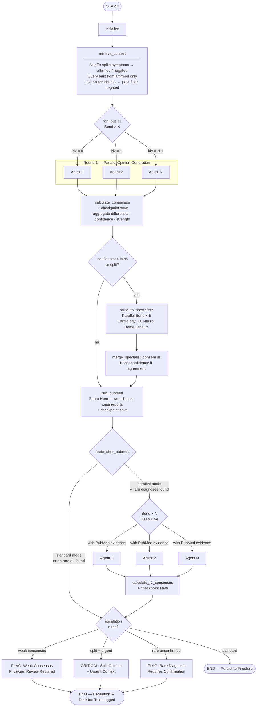

# MedGemma Clinical Assistant

**AI-powered clinical decision support built on MedGemma and MedASR.**

> Built for the [Google MedGemma Impact Challenge](https://www.kaggle.com/competitions/med-gemma-impact-challenge)

---

## Quick Start

```bash
# Simulated mode (no GPU required)
SIMULATED_MODE=true uv run python main.py

# Full mode (requires MedGemma + MedASR access)
uv run python main.py
```

Open: http://localhost:8000

---

## Features

### Encounter — Multimodal SOAP Generation

The physician speaks; MedGemma listens. MedASR transcribes dictation in real time while MedGemma simultaneously analyses attached medical images (X-ray, CT, MRI). The system merges speech, imaging findings, and live FHIR EHR context into a structured SOAP note with ICD-10 codes, critical alerts, and missed-diagnosis flags — all pending physician approval before committing to the chart.

A background PubMed synthesis agent runs three searches in parallel: rare-diagnosis hunting, evidence-based medicine validation, and drug–drug interaction monitoring. Results surface in a collapsible literature panel beside the note.


---

### Diagnostic Council — Long-Horizon Multi-Agent Deliberation with Stateful Checkpointing

**Five independent MedGemma instances** reason over the same case in parallel via a LangGraph fan-out graph. Each produces a ranked differential with confidence scores. The orchestrator aggregates all five into consensus, surfacing agreement and divergence.

#### Key Features

**Phase 1: Core Long-Horizon Infrastructure** ✓
- **Persistent Checkpointing**: State snapshots after retrieve_context → r1_consensus → run_pubmed → r2_consensus; resumption branches from latest checkpoint preserving original audit trail
- **Firestore Persistence**: All workflows, checkpoints, decision trails, and evidence cached per workflow_id with branching support (re_deliberate_v1, re_deliberate_v2, etc.)
- **Decision Trails**: Full audit logging of diagnostic evolution—every opinion, consensus update, evidence source, and physician action recorded immutably

**Phase 2: Specialist Sub-Councils Routing** ✓
- **Confidence-Triggered Routing**: Weak consensus (confidence < 60%) or split opinions automatically invoke 5 specialist councils (Cardiology, Infectious Disease, Neurology, Hematology, Rheumatology) in parallel
- **Send API Parallelization**: Specialists run concurrently; consensus merged with main deliberation when agreement detected
- **Specialist Alignment Tracking**: Decision trail captures which specialists agreed/disagreed with final diagnosis

**Phase 3: Re-Deliberation Orchestration** ✓
- **Automatic Triggers**: New EHR observations, PubMed rare-disease findings, or manual physician requests branch re-deliberation from latest checkpoint
- **Manual Physician Request**: Physicians can request re-deliberation on specific cases with optional evidence injection
- **Low-Confidence Watchdog**: Automatic monitoring escalates weak-consensus cases for re-deliberation after 24h or on new clinical events
- **Escalation Rules**: Weak consensus + urgent/emergent → CRITICAL flag; split consensus → WARNING + specialist referral; rare diagnosis without confirmation → physician review required

**Phase 4: Evidence Aggregation & Decision Analysis** ✓
- **Multi-Source Evidence**: 11 evidence types (PubMed, EHR, specialists, clinical trials, etc.) with GRADE-based reliability tiers (HIGH / MODERATE / LOW / VERY_LOW)
- **Bias Scoring**: 0–1 bias penalty applied to evidence quality composite; evidence recommendations auto-generated
- **Full-Text Search Queries**: DecisionTrailQuery supports complex filtering on evidence type, confidence, specialist alignment, and timestamp ranges
- **Diagnostic Narrative Generation**: Automated consensus evolution summary with timeline visualization

**Phase 5: Physician Override & Closed-Loop Learning** ✓
- **Override Capture**: 7 override types tracked (diagnosis changed, confidence adjusted, specialist added, escalation dismissed/triggered, investigation added/skipped)
- **Specialist Feedback Loop**: 6 feedback types (correct, incorrect, incomplete, over-referred, helpful, redundant) with accuracy scores (0.0–1.0)
- **Automatic Routing Tuning**: RoutingFeedbackLearner analyzes specialist accuracy; recommends threshold adjustments (increase, decrease, auto-route, remove) when confidence > 0.6
- **Learning Dashboard**: Case outcome metrics, system-level accuracy, specialist leaderboards, and escalation trends queryable at any time

#### Workflow Graph

When consensus is weak or rare diagnosis appears in the PubMed hunt, the council enters a **Deep Dive** second round: PubMed findings injected as context; agents deliberate again, updating or defending positions. If consensus remains weak, specialist councils are invoked. All decisions persist with full evidence trail.



#### Stateful Integration

1. **Checkpoint Storage**: Firestore saves full workflow state after consensus calculation (node: calculate_consensus, r2_consensus); enables instant resumption when new evidence arrives
2. **Re-Deliberation Branching**: New deliberations branch from checkpoint with unique branch_name (re_deliberate_v1, re_deliberate_v2); original audit trail remains immutable
3. **Decision Trail Recording**: Every round, specialist invocation, evidence source, and override recorded with full timestamp + physician context
4. **Escalation Dispatch**: Rules engine auto-flags weak consensus, split opinions, or rare-unconfirmed diagnoses; blocks closure pending explicit physician acknowledgment


---

### AI Chat Portal — Physician Queries with Image Annotation & Zoom

Physicians can ask free-form questions, attach medical images, and draw bounding boxes to direct MedGemma's attention to a specific region of interest. Voice input is supported alongside text. Based on the message intent, a PubMed evidence agent dispatches automatically and appends supporting literature alongside MedGemma's response.

**Image Viewer Features:**
- **Zoom Controls**: Zoom in/out with buttons (+/−), mouse wheel scroll, or keyboard shortcuts (+, −, R for reset)
- **Zoom Range**: 50% to 300% magnification
- **Pan Support**: Drag the image to explore zoomed regions
- **Annotation Preservation**: User-drawn (amber) and AI-generated (red) annotations remain perfectly aligned at any zoom level
- **Real-time Updates**: All annotations stay synchronized during zoom and pan operations

Annotations are stored in normalized coordinates [0-1], making them zoom-independent — the zoom feature is purely a visual presentation layer that doesn't affect annotation accuracy or alignment.


---

### Inpatient Workflow

<table>
<tr>
<td width="50%">

**Rounding — 24-Hour Progress Notes**

MedGemma generates a SOAP progress note for each admitted patient covering the prior 24 hours. An auto-extracted to-do checklist (pending labs, consults, medication changes) is appended so the rounding physician has a ready action list.


</td>
<td width="50%">

**Handoff — SBAR Sign-Out with Completeness Audit**

Structured SBAR sign-out is generated from the inpatient record and scored against an 8-point completeness checklist (code status, allergies, high-risk medications, contingency plans, and more). Missing fields are flagged and block sign-off until resolved.


</td>
</tr>
<tr>
<td width="50%">

**Safety Dashboard — Inpatient Watchlist**

Rule-based alerts fire for VTE prophylaxis gaps, Foley catheter dwell time, high-risk medication monitoring, and overdue documentation. Extended rules cover falls risk (Morse scale), pressure ulcer risk (Braden), antibiotic de-escalation, and glycemic control.


</td>
<td width="50%">

**Shift Brief — Pre-Shift Panel Summary**

An AI-generated narrative briefing covers the entire patient panel for any physician starting a shift: active problems, overnight events, pending results, and high-priority patients. Produced on demand in seconds from the current EHR snapshot.


</td>
</tr>
</table>

---

### SOAP Compliance Monitor

Tracks documentation quality across all encounters. Flags notes with missing sections, incomplete symptom duration, and abnormal documentation rates. Provides per-physician and panel-level compliance metrics queryable at any time.


---

### Simulation — Resident Training & Debrief

MedGemma plays a standardised patient. Residents take history, examine, order investigations, then submit a diagnosis and management plan. MedGemma scores the encounter across five clinical domains (history, examination, investigations, diagnosis, management) and generates a structured debrief with specific feedback per domain.

The patient persona is **stateful** — powered by a LangChain `RunnableWithMessageHistory` chain (`src/simulation/chat_chain.py`). Every prior exchange is injected via a `MessagesPlaceholder` into the prompt on each turn, so the patient never contradicts itself within a session ("the pain started 2 hours ago" stays 2 hours ago regardless of how the question is phrased later). Session history is released automatically when the resident submits for scoring.

```
ChatPromptTemplate (system: case context)
  + MessagesPlaceholder("history")   ← all prior turns injected here
  + HumanMessage(question)
        │
        ▼
MedGemmaRunnable(Runnable)           ← bridges LangChain messages → agent API
  ├─ agent.generate_medgemma()       (VLLMModelManager)
  └─ agent.chat()                    (MedGemmaAgent / HF Transformers)
        │ AIMessage
        ▼
RunnableWithMessageHistory           ← persists HumanMessage + AIMessage
  └─ InMemoryChatMessageHistory        into per-session store after every turn
       keyed by session_id
```

<table>
<tr>
<td width="50%">

</td>
<td width="50%">

</td>
</tr>
</table>

---

### Rare Disease Director — TTT-Inspired Diagnostic Hunt

When common diagnoses have been ruled out, the Rare Disease Director gives clinicians **directional guidance** toward rare disease candidates. Inspired by test-time training (TTT), the system refines its hypothesis set iteratively at inference time using a diagnostic reward function — without any weight updates, making it practical on 8 GB VRAM.

The entry point is `/rare-disease`. A clinician enters symptoms, labs, imaging findings, and an optional history note; the director returns a ranked list of rare disease candidates with evidence tiers, matching/anti-features, confirmatory tests, specialist referral type, and urgency.

```
[Round 0] Symptom Fingerprinting + Ontology Seed Hypotheses (fast, no LLM)
          ─ curated knowledge base of ~60 rare diseases across 8 organ systems
          ─ ≥2 trigger-symptom matches → seed hypothesis
                │
                ▼
[Round 1] MedGemma LLM Hypothesis Generation
          ─ structured JSON prompt for 5 rare disease candidates with reasoning
          ─ merged with ontology seeds (dedup by name)
                │
                ▼
[TTT Loop — max 3 iterations]
  ├─ PubMed Zebra Hunt per hypothesis (reuses PubMedSynthesisAgent.case_matcher)
  ├─ Reward = 0.40 × symptom_coverage
  │         + 0.40 × evidence_strength
  │         + 0.20 × coherence_score
  ├─ best_reward ≥ 0.55 → CONVERGE (early exit)
  ├─ iter 1 expansion: ontology adjacency + mimics for top-3 hypotheses
  └─ iter 2+ expansion: LLM self-critique for still-unexplained features
                │
                ▼
Direction Report (top N hypotheses, ranked by reward)
  ─ Evidence tier: well-evidenced / some-evidence / speculative
  ─ Matching features (✓) and anti-features (✗ absent high-weight findings)
  ─ Confirmatory tests, specialist referral, urgency
  ─ TTT convergence metadata (iterations used, final reward)
  ─ Mandatory disclaimer: directional guidance, requires physician validation
```

Ontology coverage spans 8 organ systems: Rheumatologic · Metabolic/Genetic · Hematologic · Neurologic · Endocrine · Vascular/Cardiac · Hepatic/GI · Pulmonary. Representative entries include HLH, Wilson's Disease, Antiphospholipid Syndrome, MELAS, TTP, Takayasu Arteritis, POEMS Syndrome, and ~55 others.

Every hunt is logged to the audit trail with symptom count, iteration count, and the top hypothesis name.

---

### Additional Capabilities

| Capability | Description |
|---|---|
| **AI-Generated Bounding Boxes** | MedGemma automatically generates red dashed bounding boxes to localize detected findings (e.g., pneumonia, opacity, fracture) with confidence scores; user-drawn boxes (amber) remain overlaid for comparison |
| **Image Zoom & Pan** | 50–300% zoom via buttons, mouse wheel, or keyboard (+/−/R); pan via click-and-drag when zoomed; all annotations stay perfectly aligned at any magnification |
| **Patient Portal** | Patient-facing Q&A with emergency detection and safety guardrails |
| **Patient Memory (Mem0)** | Persistent cross-encounter memory — MedGemma recalls prior visits |
| **Discharge Planner** | Patient-friendly discharge summaries with LACE readmission risk scoring (HIGH / MEDIUM / LOW) |
| **Prior Authorization** | Auto-detects orders requiring prior auth; approve/deny workflow with AI-generated referral letters |
| **Medication Reconciliation** | Compares admission medications against inpatient orders; surfaces added and discontinued drugs |
| **Negation-Aware RAG** | MedGemma extracts affirmed/negated findings directly from the note (handles shorthand, contextual negation); NegEx used as fallback. Negated terms excluded from retrieval query and used to post-filter contradicting chunks |
| **Stateful Simulation Chat** | `RunnableWithMessageHistory` + `InMemoryChatMessageHistory` (LangChain) keeps per-session patient-persona context — patient never contradicts prior answers; history released on scoring |
| **Local Health Trends** | Correlates local public-health and environmental events with same-day symptom patterns |
| **External Medical Vocabulary** | NLM MeSH enrichment with shared Firestore cache and optional vector expansion |
| **Multi-Hospital Config** | Multi-tenant registry with per-hospital formulary restrictions and feature flags |
| **Audit Logging** | Immutable event trail for all clinical AI actions with optional Firestore persistence |
| **Performance Profiling** | Built-in latency tracker for all major clinical API operations; queryable via `GET /api/metrics` |
| **Role-Based Access** | Doctor, Nurse, Resident, Admin, and Patient roles with scoped permissions |

---

## Architecture

```
MedASR (Speech) ─┐
                 ├─→ FunctionGemma Router ─→ MedGemma 4B ─→ SOAP Generator ─→ Doctor Approval ─→ EHR
Medical Image ───┘         ↑                      ↑
                            │                      │
                    FHIR EHR Context         PubMed Literature
                    Mem0 Memory Recall        Model extraction RAG (NegEx fallback)

LangGraph Council:
  START → initialize → retrieve_context (NegEx-aware RAG)
        → [Send × N] generate_r1_opinion  (parallel fan-out)
        → calculate_consensus
        → run_pubmed (Zebra Hunt)
        ├─ [iterative] → [Send × N] generate_r2_opinion → calculate_r2_consensus → END
        └─ [standard]                                                             → END

LangChain Simulation:
  ChatPromptTemplate + MessagesPlaceholder("history")
        → MedGemmaRunnable (Runnable)
        → RunnableWithMessageHistory (InMemoryChatMessageHistory keyed by session_id)

Rare Disease Director (TTT-inspired):
  Symptom Fingerprinting → Ontology Seeds (no LLM)
        → [optional] MedGemma LLM Hypothesis Generation
        → TTT Loop (max 3 iter):
             PubMed Zebra Hunt per hypothesis
             Reward = 0.40×coverage + 0.40×evidence + 0.20×coherence
             reward ≥ 0.55 → converge | else expand (adjacency → self-critique)
        → RareDiseaseReport (ranked, evidence-tiered, with convergence metadata)
```

## Project Structure

```
├── main.py                 # FastAPI server (all routes)
├── AGENTS.md               # Agent and tool definitions
├── src/
│   ├── agent/              # MedGemma agent, tools, clinical correlation
│   ├── asr/                # MedASR streaming
│   ├── auth/               # Role-based access control + prior authorization
│   ├── clinical/           # ICD-10, negation detection, drug interactions, alerts
│   ├── compliance/         # SOAP compliance monitoring
│   ├── council/            # Diagnostic Council (LangGraph multi-agent graph)
│   ├── ehr/                # Mock FHIR server
│   ├── history/            # Patient timeline and history service
│   ├── memory/             # Mem0 patient memory integration
│   ├── portal/             # Patient-facing portal with guardrails
│   ├── pubmed/             # PubMed NCBI E-utils client + synthesis agent
│   ├── trends/             # Local health trends + external medical vocabulary
│   ├── inpatient/          # Rounding, SBAR handoff, safety watchlist, discharge
│   ├── audit/              # Immutable audit event trail
│   ├── config/             # Multi-hospital registry
│   ├── monitoring/         # Performance profiling
│   ├── referral/           # Specialist referral letter generation
│   ├── simulation/         # Resident simulation engine + LangChain stateful chat chain
│   ├── rare_disease/       # TTT-inspired rare disease director (ontology, scorer, director)
│   └── soap/               # SOAP note generation
├── static/                 # Frontend UI (app.js, ai_portal.js, styles.css)
├── templates/              # Jinja2 HTML templates
├── docs/                   # Architecture, technical write-up, testing guide
└── data/                   # Sample images and seed data
```

## Requirements

- Python 3.11+
- NVIDIA GPU with 8 GB+ VRAM (for full mode)
- HuggingFace access to `google/medgemma-1.5-4b-it` and `google/medasr`
- `OPENAI_API_KEY` (for Mem0 memory extraction — optional, graceful fallback)
- `NCBI_API_KEY` (for PubMed 10 req/s — optional, defaults to 3 req/s)

## Environment Variables

| Variable | Required | Description |
|---|---|---|
| `SIMULATED_MODE` | No | Run without GPU (all AI responses simulated) |
| `OPENAI_API_KEY` | No | Enables Mem0 patient memory extraction |
| `NCBI_API_KEY` | No | Raises PubMed rate limit from 3 to 10 req/s |
| `MEDASR_SPACE_ID` | No | HuggingFace Space ID for MedASR transcription |
| `MEDICAL_VOCAB_CACHE_BACKEND` | No | `auto` (default), `firestore`, or `local` |
| `MEDICAL_VOCAB_VECTOR_BACKEND` | No | `in_memory` (default) or `none` |
| `DISABLE_EXTERNAL_MEDICAL_VOCAB` | No | Disable external vocabulary calls |
| `GOOGLE_APPLICATION_CREDENTIALS` | No | Firebase service account key path |
| `FIREBASE_PROJECT_ID` | No | Firebase project ID |
| `FIREBASE_KEY_PATH` | No | Alternative path to Firebase credentials (default: `firebase-key.json`) |

---

## Competition

Built for the [MedGemma Impact Challenge](https://www.kaggle.com/competitions/med-gemma-impact-challenge) on Kaggle.

## License

CC BY 4.0 (per competition requirements)
