# MedGemma Clinical Assistant - Architecture Flow

## End-to-End Process Flow

```mermaid
flowchart TB
    subgraph User["👨‍⚕️ Physician Interface"]
        A[Voice Input / Text] --> B[Upload X-ray Image]
    end

    subgraph Frontend["🖥️ Web UI"]
        B --> C[WebSocket ASR]
        C --> D[Real-time Transcription]
    end

    subgraph Router["🔀 FunctionGemma Router (270M)"]
        D --> E{Query Type?}
        E -->|Simple Action| F[Tool Selection]
        E -->|Medical Query| G[Escalate to MedGemma]
    end

    subgraph Tools["🔧 Healthcare Tools"]
        F --> H[fetch_patient_ehr]
        F --> I[schedule_appointment]
        F --> J[order_lab_tests]
        F --> K[notify_care_team]
        F --> L[check_drug_interactions]
    end

    subgraph MedGemma["🧠 MedGemma (4B)"]
        G --> M[analyze_medical_image]
        G --> N[generate_soap_note]
        M --> O[Clinical Reasoning]
        N --> O
    end

    subgraph Clinical["📊 Clinical Intelligence"]
        O --> P[ICD-10 Codes]
        O --> Q[Confidence Scores]
        O --> R[Critical Alerts]
        O --> S[Drug Interactions]
        O --> T[Differential Diagnosis]
    end

    subgraph Output["📋 Enhanced SOAP Note"]
        P --> U[Final Report]
        Q --> U
        R --> U
        S --> U
        T --> U
        H --> U
    end

    subgraph Approval["✅ Physician Approval"]
        U --> V{Approve?}
        V -->|Yes| W[Update EHR]
        V -->|No| X[Edit & Resubmit]
    end

    W --> Y[(FHIR EHR)]
```

---

## Dual-Model Architecture

---

## Request Processing Pipeline

---

## Tool Routing Decision Tree

---

## Component Summary

| Layer | Component | Model/Tech | Purpose |
|-------|-----------|------------|---------|
| **Routing** | FunctionGemma | Gemma 3 270M | Fast tool selection |
| **Reasoning** | MedGemma | 4B multimodal | Medical analysis |
| **Vision** | MedGemma | SigLIP encoder | X-ray/CT analysis |
| **Clinical** | Intelligence | Rule-based + ML | ICD-10, alerts |
| **EHR** | FHIR Server | Mock/Real | Patient data |
| **Frontend** | FastAPI + JS | WebSocket | Real-time UI |
